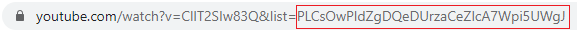

# YT-Playlist-Sorter

You can find the sorter [here](https://playlist-view-sorter.firebaseapp.com/)

Sort any YouTube playlist based on selected attributes. The playlist does not have to necessarily be your own. **Because of API limits, only the first 50 videos can be retrieved from the playlist.**

# Usage

**Note: The playlist must be public**

1. Find the ID of the playlist you wish to sort on YouTube

> In this case, the ID would be **PLCsOwPldZgDQeDUrzaCeZIcA7Wpi5UWgJ**

2. Click search

3. ???

4. Profit

5. Select a sorting option (Default sorted by most views)

# Why YouTube?

I had the idea for this project while browsing YouTube for game OSTs and wanted to listen to the most popular songs in a playlist. These playlists were often huge and very time consuming to navigate. While YouTube itself did not possess the ability to sort playlists, its API did.
